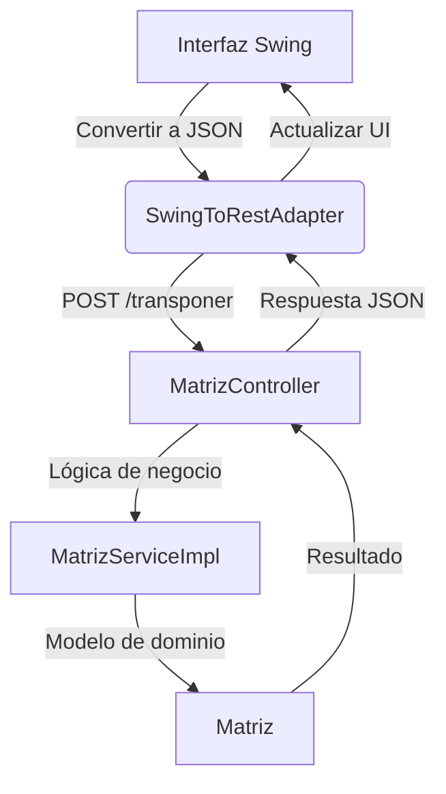
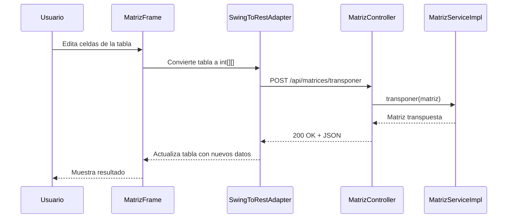

# README - Aplicación de Manipulación de Matrices


## Tabla de Contenidos
1. [Descripción General](#descripción-general)  
2. [Arquitectura del Sistema](#arquitectura-del-sistema)  
3. [Componentes del Código](#componentes-del-código)  
4. [Flujo de Operaciones](#flujo-de-operaciones)  
5. [Documentación de la API](#documentación-de-la-api)  
6. [Instalación y Configuración](#instalación-y-configuración)  
7. [Uso de la Aplicación](#uso-de-la-aplicación)  
8. [Principios de Diseño](#principios-de-diseño)  
9. [Estructura del Proyecto](#estructura-del-proyecto)  
10. [Dependencias](#dependencias)  
11. [Solución de Problemas](#solución-de-problemas)  
12. [Roadmap](#roadmap)  
13. [Contribución](#contribución)  

---

## Descripción General
Aplicación cliente-servidor para operaciones matriciales con:
- **Backend**: Servicio REST en Spring Boot (Java 17)
- **Frontend**: Interfaz gráfica Swing con tabla editable
- **Comunicación**: HTTP/JSON mediante adaptador REST

**Funcionalidades clave**:
- 🖩 Transposición de matrices  
- 📊 Visualización interactiva  
- 🔄 Conversión automática de formatos (UI → JSON → UI)

---

## Arquitectura del Sistema

## Componentes del Código

### Backend (Spring Boot)

| Clase               | Responsabilidad                              | Detalles Técnicos                          |
|---------------------|----------------------------------------------|--------------------------------------------|
| `Matriz`            | Almacena y valida la estructura de la matriz | Valida matriz no vacía en constructor      |
| `MatrizService`     | Define operaciones matriciales               | Interfaz con métodos para transponer       |
| `MatrizServiceImpl` | Implementa la lógica de transposición        | Algoritmo O(n²) con arreglos bidimensionales |
| `MatrizController`  | Maneja endpoints REST                        | Usa `@RestController` y `@PostMapping`     |
| `MatrizDto`         | Transferencia de datos cliente-servidor      | Serialización JSON automática con Jackson  |

### Frontend (Swing)

| Clase               | Responsabilidad                      | Detalles Técnicos                         |
|---------------------|--------------------------------------|-------------------------------------------|
| `MatrizFrame`       | Ventana principal con tabla editable | Usa `JTable` y `DefaultTableModel`        |
| `SwingToRestAdapter`| Comunica UI con backend              | Implementa `RestTemplate` para HTTP calls |

---

## Flujo de Operaciones

### Transposición de Matriz:



## Documentación de la API

### Endpoints Disponibles

#### `GET /api/matrices`

**Descripción**: Endpoint de bienvenida  
**Response**:
```bash
API de matrices activa. Endpoints disponibles:
- POST /api/matrices/transponer (recibe y devuelve JSON con matrices)
- POST /api/matrices/imprimir (recibe JSON y devuelve texto para impresión)
## API: Transposición e Impresión de Matrices

### POST `/api/matrices/transponer`

**Request**:
```json
{
  "datos": [
    [1, 2],
    [3, 4]
  ]
}
```
## Instalación y Configuración

### Requisitos Mínimos

- Java 17 o superior  
- Maven 3.8+  
- 512 MB de RAM libre  
- Puerto 8080 disponible  

---

### Pasos de Instalación

1. **Clonar repositorio**:
```bash
git clone https://github.com/tu-usuario/matriz-app.git
cd matriz-app
## Compilar el proyecto:

```bash
mvn clean install
```

## Ejecutar el servidor:

```bash
java -jar target/matriz-app.jar
```

## Ejecutar cliente Swing (en terminal separada):

```bash
java -cp target/matriz-app.jar org.example.matriz.swing.view.MatrizFrame
```

---

## Uso de la Aplicación

### Interfaz Gráfica

**Editar matriz:**

- Hacer doble clic en cualquier celda  
- Ingresar valores numéricos  

**Transponer:**

- Click en el botón **"Transponer"**  
- La tabla se actualizará automáticamente  

**Cambiar tamaño:**

- Editar directamente las dimensiones (disponible en próxima versión)  

---

## Verificación de Servicio

Acceder a [http://localhost:8080/api/matrices](http://localhost:8080/api/matrices) desde un navegador o Postman para confirmar que el servicio está activo.

## Licencia

Este proyecto está licenciado bajo la Licencia MIT - ver el archivo [LICENSE](LICENSE) para más detalles.
